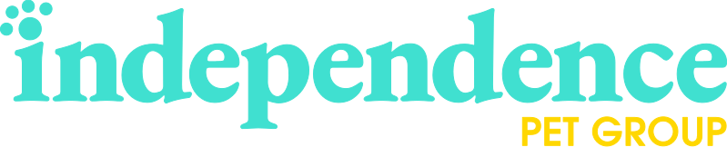

# Contributing

<!-- TODO: align to our processes -->
> **NOTE:** This is an working example `CONTRIBUTING.md` document and _**<u>NEEDS</u>**_ additional alignment with our processes.

When contributing to this repository, please first discuss the change you wish to make via issue, email, or any other method with the owners of this repository before making a change.

Please note we have a code of conduct, please follow it in all your interactions with the project.

## Code owners

The technology team owns the code and conducts reviews, approvals, and anything pertaining to this repository.

Owners are subject to change, the most up-to-date owners list can be found in the [`/CODEOWNERS.md`](/CODEOWNERS.md) document.

| Name          | Role                                         | Branch                                   | Email                   | Github         |
| :------------ | :------------------------------------------- | :--------------------------------------- | :---------------------- | :------------- |
| Chip Aubry    | <abbr title="Chief Technology Officer ">CTO  | <abbr title="Independence Pet Group">IPG | caubry@insurefigo.com   | @chipaubryfigo |
| Chip Aubry    | <abbr title="Chief Information Officer ">CIO | <abbr title="Pet Partners">PPI           | tjoyner@petpartners.com | @tjoyner2      |
| Ming Tan      | Director, Engineering                        | <abbr title="Figo Pet Insurance">FPI     | mtan@insurefigo.com     | @mingster-t    |
| Kirk Castro   | Director, Design                             | <abbr title="Figo Pet Insurance">FPI     | kcastro@insurefigo.com  | --             |
| Manish Kapoor | Product Manager                              | <abbr title="Figo Pet Insurance">FPI     | mkapoor@insurefigo.com  | --             |
| Matt Krebs    | Manager                                      | <abbr title="Figo Pet Insurance">FPI     | mkrebs@insurefigo.com   | @figokrebs     |
| George Zhou   | Architect, Backend                           | <abbr title="Pet Partners">PPI           | gzhou@petpartners.com   | @ppi-gzhou     |
| Dylan Archer  | Architect, Frontend                          | <abbr title="Figo Pet Insurance">FPI     | darcher@insurefigo.com  | @darcher-figo  |

## Pull Request checklist

Pull Request (<abbr title="Pull Request">PR</abbr>) process and proceedures.

1. Ensure any `install` or `build` dependencies are removed before the end of the layer when doing a build.
2. Update the `README.md` with details of changes to the interface, this includes new environment variables, exposed ports, useful file locations and container parameters.
3. Increase the version numbers in any examples files and the `README.md` to the new version that this <abbr title="Pull Request">PR</abbr> would represent. The versioning scheme we use is [SemVer](https://semver.org/).
4. You may merge the <abbr title="Pull Request">PR</abbr> in once you have the sign-off of two other developers, or if you do not have permission to do that, you may request the second reviewer to merge it for you.